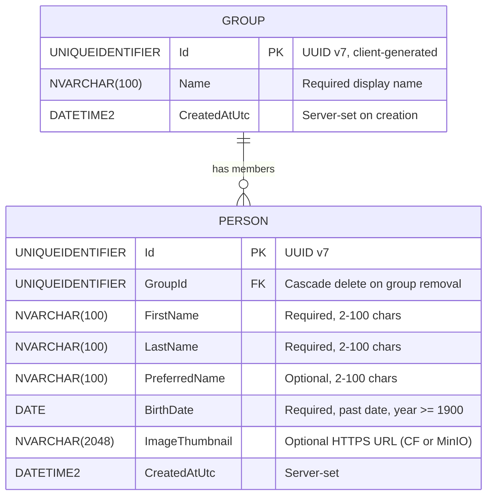

# Entity-Relationship Diagram

## Indexes

| Table | Index Name | Columns | Purpose |
|---|---|---|---|
| Person | PK (clustered) | Id | Primary key lookup |
| Person | IX_Person_GroupId | GroupId | All member lookups by group |
| Person | IX_Person_GroupId_BirthDate | GroupId, BirthDate | Birthday window queries |
| Group | PK (clustered) | Id | Primary key lookup |
